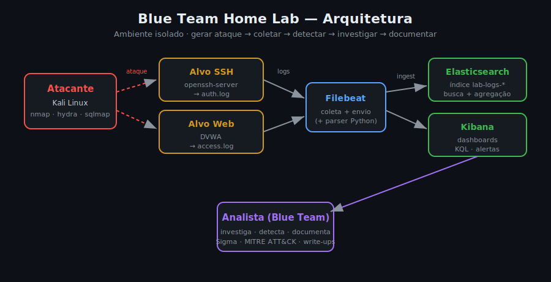

# Arquitetura

## Visão geral

O lab implementa o ciclo completo do analista de SOC em um ambiente isolado:
**gerar ataque → coletar → detectar → investigar → documentar**. Cada camada
existe para produzir ou processar telemetria de segurança.

## Componentes

| Camada | Componente | Papel |
|--------|-----------|-------|
| Ataque | Kali Linux | Gera atividade adversária controlada contra os alvos |
| Alvo | openssh-server | Host SSH que produz eventos de autenticação (`auth.log`) |
| Alvo | DVWA | App web vulnerável que produz eventos HTTP / tentativas de exploração |
| Coleta | Filebeat | Faz o ship dos logs para o Elasticsearch |
| Coleta | Scripts Python | Parseiam/normalizam (ECS) e enriquecem antes/depois da ingestão |
| SIEM | Elasticsearch | Indexa, busca e agrega os eventos (`lab-logs-*`) |
| SIEM | Kibana | Dashboards, investigação (KQL) e alertas |
| Análise | Analista + Sigma | Escreve detecções, investiga e documenta como incidente |

## Fluxo de dados

1. O atacante executa uma técnica (ex.: brute-force SSH) contra um alvo do lab.
2. O alvo registra a atividade em seus logs (`auth.log`, access log).
3. O Filebeat coleta esses logs e envia ao Elasticsearch (índice `lab-logs-*`).
   - Opcionalmente, `scripts/parse_auth_log.py` normaliza para ECS e já sinaliza
     brute-force por agregação, e `scripts/enrich_iocs.py` adiciona contexto de IP.
4. No Kibana, o analista caça a atividade com KQL/DSL e valida a regra de detecção.
5. A detecção é formalizada em **Sigma** (independente de fornecedor) e o caso é
   documentado como **write-up de incidente**, mapeado ao **MITRE ATT&CK** e à
   **Cyber Kill Chain**.

## Decisões de projeto

- **Sigma como fonte da verdade**: a lógica de detecção vive em Sigma, portável
  para qualquer SIEM; o KQL/DSL é só a implementação neste Elastic.
- **ECS (Elastic Common Schema)**: os eventos normalizados usam campos ECS
  (`source.ip`, `event.action`, `user.name`) para consistência de query.
- **Offline-safe por padrão**: o enriquecimento não faz chamadas de rede a menos
  que você conecte explicitamente um feed de reputação — evita vazar IOCs.
- **Segurança de lab**: portas em `127.0.0.1`, credenciais fracas só nos alvos,
  segurança do ES desabilitada **exclusivamente** para simplificar o ambiente.

## Próximos incrementos (roadmap)

- Sysmon-for-Linux / auditd para telemetria de processo (detecção de
  execução e persistência).
- Regras Sigma adicionais (privilege escalation, lateral movement).
- Conversão automatizada Sigma → Elastic com `sigma-cli` no CI.
- Painel de cobertura ATT&CK (Navigator layer).
